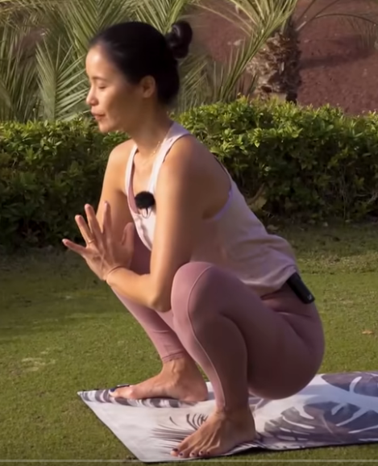

#  Vinyasa Flow | Piernas y Apertura de Caderas

[https://www.youtube.com/watch?v=134Dtv1ehqw](https://www.youtube.com/watch?v=134Dtv1ehqw)

* Malasana, cuclillas, manos delante del pecho, alarga la espalda

Dos pasos hacía atrás: plancha

Sin mover los pies, ombligo dentro, redondea la espalda, perro boca abajo.

* manos al suelo
* plancha
* perro boca abajo
* vuelta a cuclillas
* repetimos 3 en total
* ultima subimos a sisen
* bajamos manos a las rodillas doblamos espalda estirada
* una mano al suelo otra arriba pies juntos
* 3 vueltas de saludos al sol 3 respiraciones en perro boca abajo
* medio saludo al sol para quedarse en corredor
* bajamos una rodilla manos en la otra rodilla empujamos la cadera hacia abajo
* mano arriba mano abajo levantamos rodilla corredor
