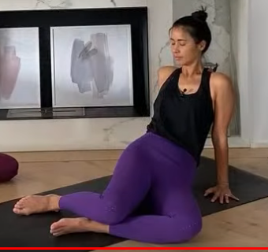

# Torsiones

[https://www.youtube.com/watch?v=LbJMfdCFGLc](https://www.youtube.com/watch?v=LbJMfdCFGLc)

* Calentamiento: brazos en cruz, lleva las manos a los hombros.

Coger aire derecha, soltarlo izquierda.

* Giramos a la derecha, mano derecha muslo izquierdo, otra mano en el suelo.

* Flexión hacía delante, la frente en el suelo.

Caminamos manos a la derecha, estiamos costado izquierdo.

Caminamos manos a la izquierda, estiamos costado derecho.

* Rodillas juntas, piernas flexionadas, mano izquierda abraza las piernas, mano derecha en el suelo. Alarga la espalda.

* Malasana: cuclillas, manos delante del pecho, eleva la coronilla.

* (TODO: buscar nombre)

* Descansamos abajo, tronco flexionado, cabeza hacía abajo.

* Saludos al sol:
    * Desde de pie, estiramos coronilla, bajamos flexionado el tronco. Pie derecho atras, posición del corredor con rodilla en el suelo.
    * Pequeña retención, pasamos  a la plancha. Bajamos rodillas, bajamos pecho.
    * Extensión lumbares.
    * Perro boca abajo.
    * Pie derecho entre las manos.
    * Subimos. Brazos por fuera hasta arriba, bajamos brazos postura de la montaña.

* Mismo flow que antes para bajar hasta corredor, paso más pequeño que antes.

Ambas piernas forman ángulos de 90°. Mano derecha rodilla, mano izquierda espalda.

* Desde corredor, pie izquierdo delante, mano derecha en el suelo, mano izquierda arriba.

* Desde ukatasana, postura de la silla, 5 respiraciones

Torsion de ukatasa, manos delante del pecho, pasamos el codo fuera, hombro atras.

* Sentado, dobla rodilla derecha, cruza rodilla derecha a la altura de la rodilla, abraza tu pierna, mira hacia atrás.

* Descruzamos, bajamos la rodilla y hacemos flexión. Alargamos la espalda y caminamos hacía delante.

* Rodillas hacía un lado pero el pecho sigue mirando de frente.

* Espalda en el suelo, rodillas flexionadas, brazos en cruz. Lenvanta las piernas y cruza las piernas y dejamos caer hacía el lado de la no cruzada.

* Masaje de espalda con las piernas flexionadas, abranzando las rodillas.

